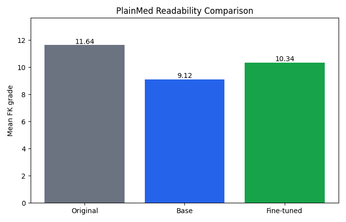

# PlainMed

PlainMed is a small medical text simplification project that rewrites expert medical text into plainer language a patient can understand. It uses the Med-EASi dataset, formats expert-to-simple pairs for OpenAI chat fine-tuning, fine-tunes `gpt-4o-mini-2024-07-18`, evaluates readability, and serves the result in a Streamlit app.

## Why this matters

Health literacy is a real barrier in healthcare. Patients often receive notes, discharge summaries, portal messages, and research-style explanations that use clinical vocabulary, long sentences, or missing context. A simplification tool can help make medical text easier to approach, while still needing careful review because easier text is not automatically accurate text.

## Dataset

This project uses Med-EASi from Hugging Face:

- Hugging Face: https://huggingface.co/datasets/cbasu/Med-EASi
- Citation: Basu, C., Vasu, R., Yasunaga, M., & Yang, Q. (2023). "Med-EASi: Finely Annotated Dataset and Models for Controllable Simplification of Medical Texts." arXiv:2302.09155.

The dataset script cleans expert-to-simple pairs, removes empty and duplicate rows, samples 250 training pairs, and holds out 20 test pairs with a fixed seed.

## Fine-tuning approach

PlainMed uses supervised fine-tuning through the OpenAI API. The training file is written in OpenAI chat fine-tuning JSONL format:

- system: `You rewrite medical text in plain language a patient can understand.`
- user: expert medical text
- assistant: simplified text

The base fine-tuning model is `gpt-4o-mini-2024-07-18`. The app compares against `gpt-4o-mini` for evaluation and uses the fine-tuned model ID saved in `models/model_id.txt`.

Feature engineering happens inside `scripts/make_dataset.py`. In this project, the main feature engineering choice is the prompt/completion formatting: each Med-EASi pair is converted into a consistent chat example with the same system instruction used later at inference time.

## Results

Evaluation used 20 held-out Med-EASi examples and Flesch-Kincaid grade level through `textstat`.

| Text type | Mean FK grade |
| --- | ---: |
| Original expert text | 11.64 |
| Base `gpt-4o-mini` output | 9.12 |
| Fine-tuned output | 10.34 |

The fine-tuned model reduced average reading grade compared with the original expert text. In this small evaluation, the base model produced the lowest mean FK grade, so the fine-tuned model is not automatically better on readability alone.



Example:

| Original | Base output | Fine-tuned output |
| --- | --- | --- |
| Pancreatitis is common. | Pancreatitis is a common condition. | Pancreatitis is common in people with cystic fibrosis. |

## Setup

Create and activate a virtual environment:

```bash
python3 -m venv .venv
source .venv/bin/activate
```

Install dependencies:

```bash
pip install -r requirements.txt
```

Set environment variables:

```bash
export OPENAI_API_KEY="your_openai_api_key"
```

Optional for deployment or if `models/model_id.txt` is not present:

```bash
export MODEL_ID="ft:gpt-4o-mini-2024-07-18:..."
```

## Run order

Build the dataset files:

```bash
python3 scripts/make_dataset.py
```

Launch fine-tuning and save the model ID:

```bash
python3 scripts/model.py
```

Run evaluation:

```bash
python3 scripts/evaluate.py
```

Start the Streamlit app:

```bash
streamlit run main.py
```

## Repository structure

```text
plainmed/
├── README.md
├── main.py
├── requirements.txt
├── setup.py
├── data/
│   ├── raw/
│   ├── processed/
│   │   ├── train.jsonl
│   │   └── test.jsonl
│   └── outputs/
│       ├── eval_results.csv
│       └── readability_chart.png
├── models/
│   └── model_id.txt
├── notebooks/
│   └── eval_exploration.ipynb
└── scripts/
    ├── __init__.py
    ├── make_dataset.py
    ├── model.py
    └── evaluate.py
```

## Streamlit Community Cloud deployment

1. Push the repo to GitHub.
2. Create a new Streamlit Community Cloud app from the GitHub repo.
3. Set the main file path to `main.py`.
4. Add this secret in Streamlit app settings:

```toml
OPENAI_API_KEY = "your_openai_api_key"
```

5. If `models/model_id.txt` is not committed or you want to override it, add:

```toml
MODEL_ID = "ft:gpt-4o-mini-2024-07-18:..."
```

6. Deploy and test one example from the app.

## Ethics and limitations

- This is an educational tool, not medical advice.
- The model can hallucinate details or add context that was not present in the original text.
- Oversimplification can remove clinical caveats, uncertainty, contraindications, or urgency.
- Readability is not the same as accuracy.
- A clinician or qualified reviewer should verify any output used in a real healthcare setting.
- Patients should not use this app to make medical decisions without professional guidance.

## Notes on secrets

Do not commit API keys, `.env` files, Streamlit secrets, or pasted tokens. Use environment variables locally and Streamlit secrets in deployment.
